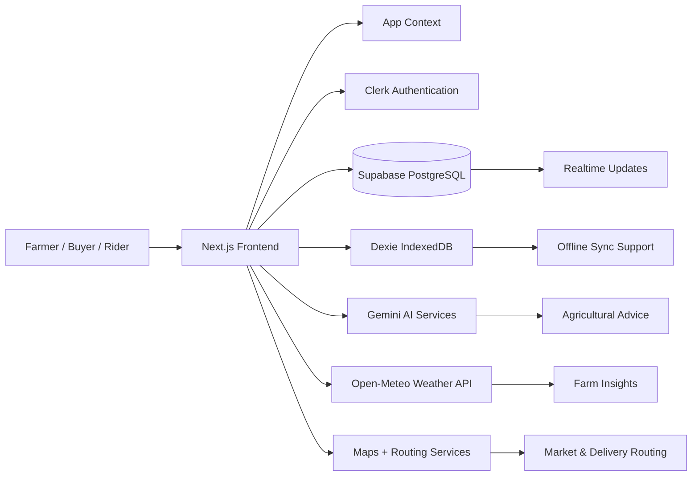

# EcoFarm

EcoFarm is a modern, multilingual digital farming platform designed to help smallholder farmers in Uganda make better decisions through AI, real-time community intelligence, and seamless access to markets and logistics.

It combines farm insights, pest reporting, weather prediction, market discovery, and agricultural guidance into a single experience that is simple, practical, and accessible.

## Overview

EcoFarm was built to solve a very real problem in rural agriculture: farmers often work with fragmented information, limited access to markets, delayed pest alerts, and weak logistics support. This platform brings those services together in one place so farmers can act faster and with more confidence.

The system is designed to be useful for three key groups:

- Farmers who need practical guidance and quick field support
- Buyers who want access to verified produce and transparent listings
- Riders and logistics partners who can find delivery jobs easily

## Problem Statement

Many farmers still face challenges such as:

- Late or inaccurate pest information
- Difficulty finding buyers for fresh produce
- Poor visibility into weather and planting timing
- Limited access to trustworthy agricultural advice
- Weak coordination between production and transport

EcoFarm addresses these challenges by combining digital tools with local context, voice support, and AI-based guidance.

## Solution

EcoFarm provides a smart farming dashboard where users can:

- Receive personalized agricultural advice
- Diagnose crop issues using images and voice
- Report and view pest alerts in real time
- Explore produce listings and nearby eco-buyers
- Track logistics and transport needs
- Access localized information in multiple languages

The experience is built to feel simple and welcoming while still being powerful enough for real farm operations.

## Core Features

### 1. AI Crop Diagnosis
- Upload or capture crop images
- Analyze plant health with generative AI
- Receive visual recovery steps and guidance

### 2. Village Elder Chat
- Ask agricultural questions in a conversational interface
- Receive guidance in multiple languages
- Support voice-based interaction for accessibility

### 3. Pest Alerts & Community Intelligence
- Report pests from the field
- View active alerts from other farmers
- Share field observations to reduce spread

### 4. Direct Market Access
- List produce for buyers
- Explore market opportunities
- Connect with eco-buyers and registered trading channels

### 5. Logistics & Transport
- View logistics and transport workflows
- Request support for delivery coordination
- Track movement and operational status

### 6. Multilingual Experience
- Built with localization support for English, Luganda, Runyankole, Lusoga, Acholi, and Swahili
- Makes the platform more inclusive for local users

## Tech Stack

EcoFarm is built using a modern full-stack web architecture:

- Frontend: Next.js 14, React, TypeScript
- Styling: Tailwind CSS
- Authentication: Clerk
- Database & Realtime: Supabase
- Offline/local storage: Dexie (IndexedDB)
- AI: Google Gemini
- Maps & Geospatial: Leaflet, Google Maps, OSRM-based routing helpers
- Weather Data: Open-Meteo API

## System Architecture



## Application Workflow

A typical user journey looks like this:

1. Sign in or continue as a guest
2. Open the dashboard to view farm status and weather
3. Use AI tools to analyze crops or ask farming questions
4. Report pests or review alerts from the community
5. Browse market listings and connect with buyers
6. Coordinate delivery or logistics support
7. Continue monitoring the farm through live updates

## Project Structure

```text
src/
  app/                # App router pages and layouts
  components/         # Reusable UI modules
  context/            # Global application state
  lib/                # API, database, AI, and utility logic
```

## Getting Started

### Prerequisites

- Node.js 18 or newer
- npm or pnpm
- A Supabase project
- A Clerk account
- A Gemini API key

### Installation

```bash
npm install
```

### Environment Variables

Create a .env.local file and add the following values:

```bash
NEXT_PUBLIC_CLERK_PUBLISHABLE_KEY=your_clerk_publishable_key
CLERK_SECRET_KEY=your_clerk_secret_key
NEXT_PUBLIC_SUPABASE_URL=your_supabase_url
NEXT_PUBLIC_SUPABASE_ANON_KEY=your_supabase_anon_key
NEXT_PUBLIC_GEMINI_API_KEY=your_gemini_api_key
```

### Run Locally

```bash
npm run dev
```

Then open http://localhost:3000 in your browser.

## Development Notes

The platform follows a modern product workflow:

- UI-first experience for farmers
- Modular component design for fast iteration
- API-driven services for scalability
- Local-first storage support for resilience and offline readiness
- Extensible architecture for future features such as payments, mobile apps, and field sensors

## Credits

This project was developed and contributed by:

- ALIMPA ANNE HILLARY
- EGABO AARON
- NATOZO PATIENCE MARTHA
- NIWASIIMA ASHELYCOLE
- RWOTHOMIO EVANS .E.
- ONYANGO JOHN STEVEN

## License

This project is intended for educational, prototype, and collaborative development purposes unless otherwise specified by the project owners.
